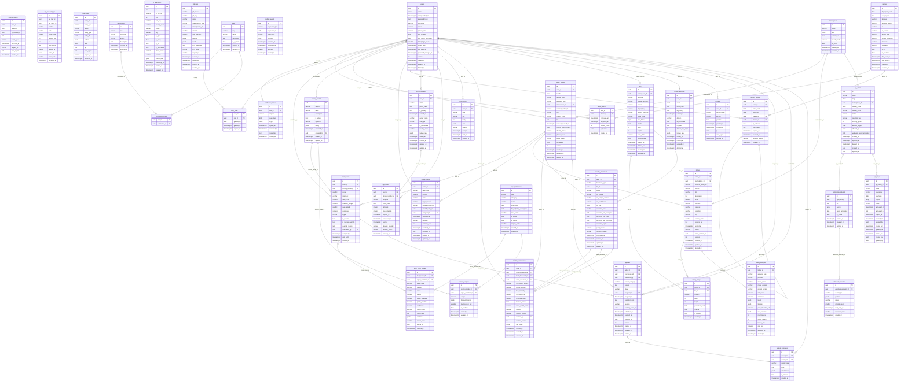

<!-- Generated by tools/erd/generate.py. Do not edit by hand. -->

# TrustLens ER diagram

40 tables.

```mermaid
erDiagram
  access_events {
    uuid id PK
    uuid user_id
    uuid device_id
    uuid ip_address_id
    inet ip
    varchar event_type
    timestamptz occurred_at
    varchar request_id
    text user_agent
    timestamptz created_at
  }
  api_clients {
    uuid id PK
    varchar name
    citext slug
    uuid marketplace_id FK
    citext contact_email
    varchar contact_name
    varchar status
    varchar rate_limit_tier
    int monthly_quota
    array allowed_origins
    array allowed_ips
    blob webhook_secret_encrypted
    timestamptz created_at
    timestamptz updated_at
    timestamptz deleted_at
    uuid created_by
    uuid updated_by
  }
  api_keys {
    uuid id PK
    uuid api_client_id FK
    varchar name
    varchar key_prefix
    blob key_hash
    array scopes
    varchar status
    timestamptz last_used_at
    inet last_used_ip
    timestamptz expires_at
    timestamptz revoked_at
    uuid revoked_by
    timestamptz created_at
    timestamptz updated_at
    timestamptz deleted_at
    uuid created_by
    uuid updated_by
  }
  api_request_logs {
    uuid id PK
    uuid api_key_id
    uuid api_client_id
    varchar method
    varchar path
    smallint status_code
    int latency_ms
    inet ip
    text user_agent
    varchar request_id
    uuid seller_id
    varchar error_code
    timestamptz occurred_at
  }
  appeal_messages {
    uuid id PK
    uuid appeal_id FK
    uuid sender_id FK
    varchar sender_role
    text body
    jsonb attachments
    bool is_internal
    timestamptz created_at
  }
  appeals {
    uuid id PK
    uuid seller_id FK
    uuid trust_score_id FK
    uuid submitted_by FK
    varchar reason_category
    text reason
    varchar status
    uuid assigned_to FK
    timestamptz assigned_at
    text resolution_note
    varchar decision
    uuid resulting_score_id
    timestamptz submitted_at
    timestamptz resolved_at
    uuid resolved_by
    int version
    timestamptz created_at
    timestamptz updated_at
    timestamptz deleted_at
  }
  audit_logs {
    uuid id PK
    uuid actor_id
    varchar actor_type
    varchar action
    varchar entity_type
    uuid entity_id
    jsonb before
    jsonb after
    inet ip
    text user_agent
    varchar request_id
    timestamptz occurred_at
  }
  consents {
    uuid id PK
    uuid user_id FK
    varchar consent_type
    varchar version
    bool granted
    timestamptz granted_at
    timestamptz revoked_at
    inet ip
    text user_agent
    timestamptz created_at
  }
  devices {
    uuid id PK
    blob fingerprint_hash
    text user_agent
    varchar browser
    varchar browser_version
    varchar os
    varchar os_version
    varchar device_type
    varchar screen_resolution
    varchar timezone
    varchar languages
    bool is_bot
    bool is_emulator
    timestamptz first_seen_at
    timestamptz last_seen_at
    timestamptz created_at
    timestamptz updated_at
  }
  email_addresses {
    uuid id PK
    uuid user_id FK
    citext email
    blob email_hash
    bool is_primary
    timestamptz verified_at
    varchar domain
    bool is_disposable
    bool mx_valid
    int domain_age_days
    jsonb lookup_raw
    timestamptz lookup_at
    timestamptz created_at
    timestamptz updated_at
    timestamptz deleted_at
  }
  files {
    uuid id PK
    uuid owner_user_id FK
    varchar purpose
    varchar storage_provider
    varchar bucket
    varchar object_key
    varchar original_filename
    varchar mime_type
    bigint size_bytes
    blob sha256
    int width
    int height
    varchar scan_status
    bool is_encrypted
    timestamptz expires_at
    timestamptz deleted_at
    timestamptz created_at
    timestamptz updated_at
  }
  identity_documents {
    uuid id PK
    uuid seller_id FK
    varchar document_type
    uuid file_id FK
    varchar status
    varchar ocr_engine
    varchar ocr_engine_version
    numeric ocr_confidence
    jsonb ocr_raw
    varchar extracted_name
    blob extracted_cnic_encrypted
    blob extracted_cnic_hash
    blob extracted_dob_encrypted
    date extracted_expiry
    numeric quality_score
    varchar rejection_reason
    timestamptz processed_at
    timestamptz created_at
    timestamptz updated_at
    timestamptz deleted_at
  }
  identity_verifications {
    uuid id PK
    uuid seller_id FK
    uuid front_document_id FK
    uuid back_document_id FK
    uuid selfie_document_id FK
    varchar face_match_engine
    varchar engine_version
    numeric face_similarity
    numeric face_distance
    numeric threshold_used
    bool liveness_passed
    numeric name_match_score
    varchar decision
    varchar decision_source
    uuid decided_by FK
    text decision_reason
    jsonb raw_result
    timestamptz verified_at
    timestamptz created_at
    timestamptz updated_at
  }
  ip_addresses {
    uuid id PK
    inet ip
    smallint ip_version
    int asn
    varchar asn_org
    varchar country_code
    varchar region
    varchar city
    bool is_vpn
    bool is_proxy
    bool is_tor
    bool is_datacenter
    smallint abuse_score
    varchar provider
    jsonb lookup_raw
    timestamptz looked_up_at
    timestamptz created_at
    timestamptz updated_at
  }
  job_runs {
    uuid id PK
    varchar job_name
    varchar job_key
    varchar status
    varchar related_entity_type
    uuid related_entity_id
    smallint attempt
    smallint max_attempts
    jsonb payload
    jsonb result
    text error_message
    varchar error_type
    varchar request_id
    timestamptz queued_at
    timestamptz started_at
    timestamptz finished_at
    int duration_ms
  }
  listing_analyses {
    uuid id PK
    uuid listing_id FK
    varchar analyzer_type
    varchar provider
    varchar model_name
    varchar model_version
    varchar prompt_version
    numeric risk_score
    numeric confidence
    jsonb labels
    jsonb findings
    numeric price_deviation_pct
    jsonb raw_response
    int input_tokens
    int output_tokens
    int latency_ms
    numeric cost_usd
    timestamptz analysed_at
    timestamptz created_at
  }
  listing_images {
    uuid id PK
    uuid listing_id FK
    uuid file_id FK
    smallint position
    int width
    int height
    blob perceptual_hash
    blob sha256
    bool is_primary
    timestamptz created_at
  }
  listings {
    uuid id PK
    uuid seller_id FK
    uuid marketplace_id FK
    varchar external_listing_ref
    varchar source
    varchar title
    text description
    numeric price
    varchar currency
    varchar category
    varchar condition
    varchar city
    varchar country_code
    text external_url
    timestamptz posted_at
    varchar status
    uuid latest_analysis_id
    int version
    timestamptz created_at
    timestamptz updated_at
    timestamptz deleted_at
  }
  marketplaces {
    uuid id PK
    varchar name
    citext slug
    text website_url
    varchar country_code
    bool is_active
    timestamptz created_at
    timestamptz updated_at
  }
  notifications {
    uuid id PK
    uuid user_id FK
    varchar type
    varchar title
    text body
    jsonb data
    varchar channel
    timestamptz read_at
    timestamptz sent_at
    timestamptz created_at
  }
  otp_codes {
    uuid id PK
    uuid user_id FK
    uuid phone_number_id FK
    varchar purpose
    blob code_hash
    smallint attempts
    smallint max_attempts
    timestamptz expires_at
    timestamptz consumed_at
    timestamptz sent_at
    varchar delivery_provider
    varchar delivery_status
    timestamptz created_at
  }
  outbox_events {
    uuid id PK
    varchar aggregate_type
    uuid aggregate_id
    varchar event_type
    jsonb payload
    timestamptz occurred_at
    timestamptz published_at
    smallint attempts
    timestamptz created_at
  }
  permissions {
    uuid id PK
    varchar key
    varchar resource
    varchar action
    text description
    timestamptz created_at
    timestamptz updated_at
  }
  phone_numbers {
    uuid id PK
    uuid user_id FK
    varchar e164
    blob phone_hash
    bool is_primary
    timestamptz verified_at
    varchar carrier_name
    varchar line_type
    bool is_disposable
    varchar country_code
    jsonb lookup_raw
    timestamptz lookup_at
    timestamptz created_at
    timestamptz updated_at
    timestamptz deleted_at
  }
  refresh_tokens {
    uuid id PK
    uuid user_id FK
    blob token_hash
    uuid family_id
    uuid parent_id FK
    uuid device_id FK
    inet ip_address
    text user_agent
    timestamptz expires_at
    timestamptz revoked_at
    varchar revoked_reason
    timestamptz created_at
  }
  review_cases {
    uuid id PK
    uuid seller_id FK
    varchar case_type
    smallint priority
    varchar status
    varchar trigger_reason
    varchar related_entity_type
    uuid related_entity_id
    uuid assigned_to FK
    timestamptz assigned_at
    varchar decision
    text decision_note
    timestamptz resolved_at
    uuid resolved_by
    timestamptz created_at
    timestamptz updated_at
  }
  role_permissions {
    uuid role_id PK
    uuid permission_id PK
  }
  roles {
    uuid id PK
    varchar key
    varchar name
    text description
    bool is_system
    timestamptz created_at
    timestamptz updated_at
  }
  scoring_models {
    uuid id PK
    varchar version
    varchar name
    text description
    bool is_active
    varchar algorithm
    jsonb config
    timestamptz activated_at
    uuid activated_by FK
    timestamptz created_at
    timestamptz updated_at
  }
  scoring_weights {
    uuid id PK
    uuid scoring_model_id FK
    uuid signal_definition_id FK
    numeric weight
    jsonb threshold_config
    smallint hard_cap_on_fail
    bool is_enabled
    timestamptz created_at
    timestamptz updated_at
  }
  seller_profiles {
    uuid id PK
    uuid user_id FK
    citext handle
    varchar display_name
    varchar business_type
    uuid marketplace_id FK
    varchar external_seller_ref
    varchar city
    varchar country_code
    text bio
    timestamptz account_opened_at
    uuid current_trust_score_id
    varchar identity_status
    varchar phone_status
    varchar email_status
    bool is_flagged
    int version
    timestamptz created_at
    timestamptz updated_at
    timestamptz deleted_at
  }
  signal_definitions {
    uuid id PK
    varchar code
    varchar category
    varchar name
    text description
    text buyer_facing_description
    smallint max_points
    bool is_active
    bool is_critical
    smallint display_order
    timestamptz created_at
    timestamptz updated_at
  }
  trust_score_signals {
    uuid id PK
    uuid trust_score_id FK
    uuid signal_definition_id FK
    varchar signal_code
    varchar category
    varchar status
    numeric weight
    numeric points_awarded
    numeric points_possible
    numeric confidence
    varchar reason_code
    text reason_text
    jsonb evidence
    varchar source_table
    uuid source_id
    timestamptz created_at
  }
  trust_scores {
    uuid id PK
    uuid seller_id FK
    uuid scoring_model_id FK
    smallint score
    varchar risk_level
    numeric raw_score
    numeric available_weight
    smallint cap_applied
    numeric confidence
    varchar trigger
    bool is_current
    bool is_manual_override
    text override_reason
    uuid overridden_by FK
    timestamptz computed_at
    timestamptz valid_until
    timestamptz created_at
  }
  user_devices {
    uuid user_id PK
    uuid device_id PK
    timestamptz first_seen_at
    timestamptz last_seen_at
    int session_count
    bool is_trusted
    timestamptz created_at
  }
  user_roles {
    uuid user_id PK
    uuid role_id PK
    uuid granted_by
    timestamptz granted_at
    timestamptz expires_at
  }
  users {
    uuid id PK
    citext email
    timestamptz email_verified_at
    text password_hash
    varchar full_name
    varchar status
    varchar primary_role
    bool mfa_enabled
    blob mfa_secret_encrypted
    smallint failed_login_count
    timestamptz locked_until
    timestamptz last_login_at
    timestamptz password_changed_at
    int version
    timestamptz created_at
    timestamptz updated_at
    timestamptz deleted_at
  }
  verification_tokens {
    uuid id PK
    uuid user_id FK
    varchar purpose
    blob token_hash
    citext target
    timestamptz expires_at
    timestamptz consumed_at
    inet created_ip
    timestamptz created_at
  }
  webhook_deliveries {
    uuid id PK
    uuid webhook_endpoint_id FK
    varchar event_type
    jsonb payload
    varchar status
    smallint attempt_count
    timestamptz next_retry_at
    smallint response_status
    timestamptz created_at
  }
  webhook_endpoints {
    uuid id PK
    uuid api_client_id FK
    text url
    array events
    blob secret_encrypted
    bool is_active
    timestamptz created_at
    timestamptz updated_at
    timestamptz deleted_at
  }

  marketplaces ||--o| api_clients : marketplace_id
  api_clients ||--o{ api_keys : api_client_id
  appeals ||--o{ appeal_messages : appeal_id
  users ||--o{ appeal_messages : sender_id
  seller_profiles ||--o{ appeals : seller_id
  trust_scores ||--o{ appeals : trust_score_id
  users ||--o{ appeals : submitted_by
  users ||--o| appeals : assigned_to
  users ||--o{ consents : user_id
  users ||--o{ email_addresses : user_id
  users ||--o| files : owner_user_id
  seller_profiles ||--o{ identity_documents : seller_id
  files ||--o{ identity_documents : file_id
  seller_profiles ||--o{ identity_verifications : seller_id
  identity_documents ||--o| identity_verifications : front_document_id
  identity_documents ||--o| identity_verifications : back_document_id
  identity_documents ||--o| identity_verifications : selfie_document_id
  users ||--o| identity_verifications : decided_by
  listings ||--o{ listing_analyses : listing_id
  listings ||--o{ listing_images : listing_id
  files ||--o{ listing_images : file_id
  seller_profiles ||--o{ listings : seller_id
  marketplaces ||--o| listings : marketplace_id
  users ||--o{ notifications : user_id
  users ||--o{ otp_codes : user_id
  phone_numbers ||--o| otp_codes : phone_number_id
  users ||--o{ phone_numbers : user_id
  users ||--o{ refresh_tokens : user_id
  refresh_tokens ||--o| refresh_tokens : parent_id
  devices ||--o| refresh_tokens : device_id
  seller_profiles ||--o{ review_cases : seller_id
  users ||--o| review_cases : assigned_to
  roles ||--o{ role_permissions : role_id
  permissions ||--o{ role_permissions : permission_id
  users ||--o| scoring_models : activated_by
  scoring_models ||--o{ scoring_weights : scoring_model_id
  signal_definitions ||--o{ scoring_weights : signal_definition_id
  users ||--o{ seller_profiles : user_id
  marketplaces ||--o| seller_profiles : marketplace_id
  trust_scores ||--o{ trust_score_signals : trust_score_id
  signal_definitions ||--o{ trust_score_signals : signal_definition_id
  seller_profiles ||--o{ trust_scores : seller_id
  scoring_models ||--o{ trust_scores : scoring_model_id
  users ||--o| trust_scores : overridden_by
  users ||--o{ user_devices : user_id
  devices ||--o{ user_devices : device_id
  users ||--o{ user_roles : user_id
  roles ||--o{ user_roles : role_id
  users ||--o{ verification_tokens : user_id
  webhook_endpoints ||--o{ webhook_deliveries : webhook_endpoint_id
  api_clients ||--o{ webhook_endpoints : api_client_id
```
